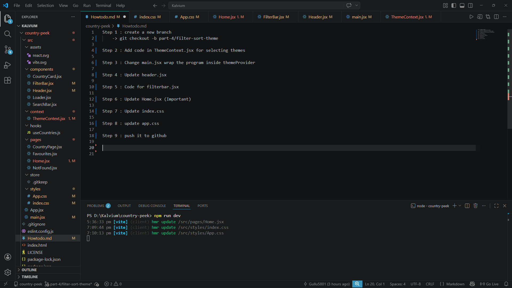

Step 1 : create a new branch
    -> git checkout -b part-4/filter-sort-theme

Step 2 : Add code in ThemeContext.jsx for selecting themes

Step 3 : Change main.jsx wrap the program inside themeProvider

Step 4 : Update header.jsx

Step 5 : Code for filterbar.jsx

Step 6 : Update Home.jsx (Important)

Step 7 : Update index.css

Step 8 : update app.css

Step 9 : push it to github

