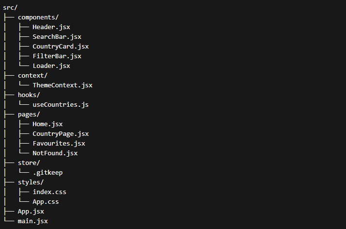

Step 1 : create a git repo as in LU and clone it

Step 2 : Write code to initialise the project then install React-Router-Dom

-> npm create vite@latest . -- --template react
-> npm install react-router-dom

Step 3 : Structure the code

Step 4 : change main.jsx

Step 5 : chnage app.jsx

Step 6 : change components/Header.jsx

Step 7 : change components/SearchBar.jsx

Step 8 : change pages/Home.jsx 

Step 9 : change pages/NotFound.jsx

Step 10 : change pages/CountryPage.jsx

Step 11 : change pages/Favourites.jsx

Step 12 : change components/CountryCard.jsx

Step 13 : change components/FilterBar.jsx

Step 14 : change components/Loader.jsx

Step 15 : chnage context/ThemeContext.jsx

Step 16 : change hooks/useCountries.js

Step 17 : add css